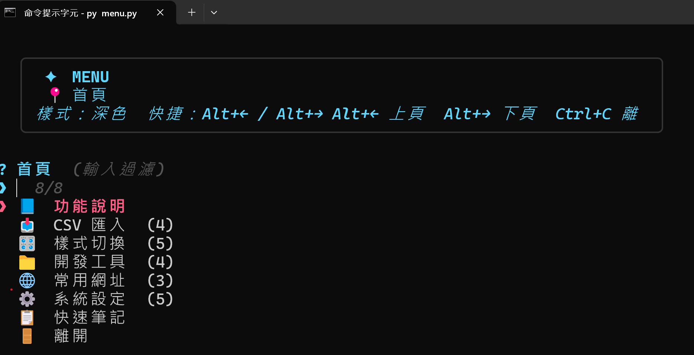
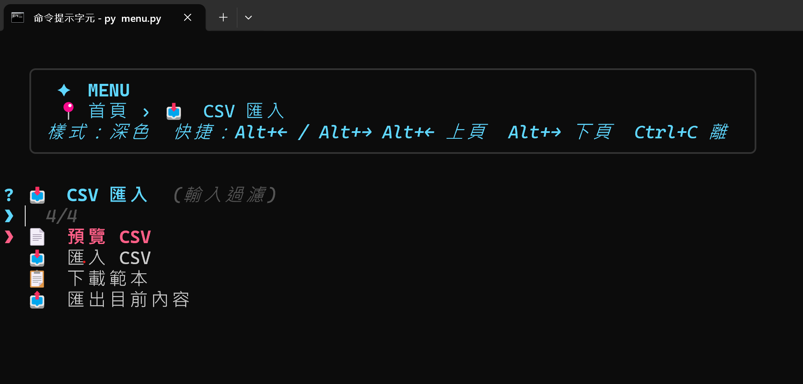
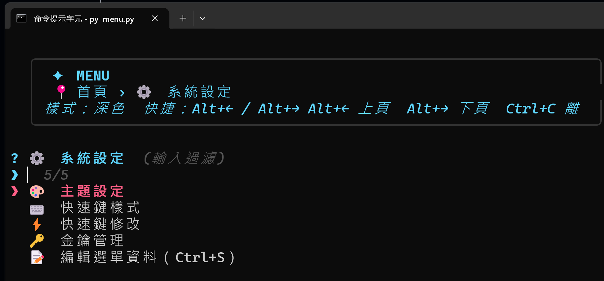

# Menu CLI

## 截圖





一個可用鍵盤操作的終端機選單工具，支援子選單、主題切換、快捷鍵修改、內建編輯器與外部腳本啟動。

## 安裝與執行

```bash
pip install -r requirements.txt
python main.py
```

Python 3.12 以上。

## 版本

- `v0.7.0`

## 技術

- Python 3.12
- InquirerPy
- prompt_toolkit
- csv / json 標準函式庫
- JSON 設定檔

## 管理與授權

- 版本控制：Git
- 授權：MIT

## 功能

- 樣式切換：切換整體色彩主題。
- 快速鍵樣式：只改畫面上顯示的快捷鍵提示格式，不改實際按鍵。
- 快速鍵修改：直接編輯實際可用的上一頁 / 下一頁按鍵。
- CSV 匯入：用 CSV 批次建立或更新選單。
- CSV 預覽：先檢查 CSV 內容，不會修改資料。
- CSV 範本：下載目前範本。
- CSV 匯出：把目前選單內容輸出成 CSV。
- 功能說明：顯示各功能用途。
- 編輯選單資料：用內建編輯器修改選單名稱與內容，按 `Ctrl+S` 存檔。
- 開發工具：執行 `.py`、`.bat`、`.jar` 檔案。
- 常用網址：直接開啟網站。
- 快速筆記：啟動筆記腳本。

## 版本演進

- `v0.1.0`：基本 fuzzy 選單。
- `v0.2.0`：主題切換與自訂配色。
- `v0.3.0`：內建選單編輯器與資料檔化。
- `v0.4.0`：快捷鍵樣式與快捷鍵切換。
- `v0.5.0`：功能說明頁、文件與同色調 UI 統一。
- `v0.7.0`：可編輯快捷鍵、CSV 匯入/匯出與文件整理。

## CSV 流程

- `menu_import.csv`：預設匯入檔。
- `menu_import_template.csv`：目前選單轉出的匯入範本。
- `menu_export.csv`：目前選單的完整匯出。
- 匯入前可以先用 `CSV 預覽` 確認內容。

## CSV 格式

欄位：`path`、`name`、`kind`、`action`

| 欄位 | 說明 |
|------|------|
| `path` | 父層路徑，以 `/` 分隔，根節點名稱可省略。例：`首頁/工具` 或 `工具` |
| `name` | 選單項目名稱（必填） |
| `kind` | `group`（資料夾）或 `action`（執行項目） |
| `action` | JSON 字串，`kind` 為 `action` 時必填（見下方 action type） |

**範例：**

```csv
path,name,kind,action
首頁,工具,group,
工具,執行腳本,action,"{""type"":""py"",""path"":""tool.py""}"
工具,開啟網頁,action,"{""type"":""url"",""url"":""https://example.com""}"
```

## Action Type

| type | 說明 | 額外欄位 |
|------|------|---------|
| `exit` | 離開程式 | — |
| `about` | 顯示功能說明 | — |
| `theme` | 切換主題 | `"theme": "dark"` / `"light"` / `"neon"` / `"custom"` |
| `style_file` | 開啟自訂配色檔 | — |
| `edit_menu` | 內建編輯器編輯選單 | — |
| `csv_preview` | 預覽 CSV 內容 | — |
| `csv_import` | 從 CSV 匯入選單 | — |
| `csv_template` | 下載 CSV 範本 | — |
| `csv_export` | 匯出選單為 CSV | — |
| `hotkey_style` | 切換快捷鍵提示樣式 | — |
| `hotkey_modify` | 修改上一頁 / 下一頁按鍵 | — |
| `url` | 開啟網址 | `"url": "https://..."` |
| `py` | 執行 Python 腳本 | `"path": "相對或絕對路徑"` |
| `bat` | 執行 bat 批次檔 | `"path": "相對或絕對路徑"` |
| `jar` | 執行 Java jar | `"path": "相對或絕對路徑"` |

## 檔案

- `menu.py`：主流程。
- `actions.py`：所有動作處理。
- `menu_data.py`：選單資料載入與儲存。
- `editor.py`：內建選單編輯器。
- `prompts.py`：Fuzzy 選單與快捷鍵組合。
- `themes.py`：主題設定。
- `state.py`：執行時設定狀態。
- `config.py`：設定檔位置與讀寫。

## 設定檔

- `data/menu_data.json`：選單內容。
- `data/menu_settings.json`：主題與快捷鍵設定。
- `data/menu_theme.json`：自訂配色。
- `data/menu_import.csv`：CSV 匯入範本。
- `data/menu_import_template.csv`：CSV 範本輸出。
- `data/menu_export.csv`：目前選單匯出。

## 操作

- `Alt+←` / `Alt+→`：上一頁 / 下一頁。
- `Ctrl+C`：離開。
- 編輯選單資料時：`Ctrl+S` 存檔，`Ctrl+C` 取消。
